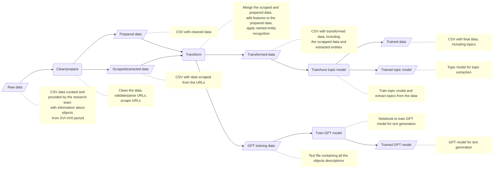

# Narrative Atoms

The Narrative Atoms project contains a set of tools for topic extraction and text generation,
using as a test case data about objects from the [Middling Culture](https://middlingculture.com/) project.

This repository provides a command line tool and a web interface to process and interact with the data.

## Workflow

## Set up

Install [poetry](https://python-poetry.org/docs/#installation) and the requirements:

    poetry install

## Run the cli

    poetry run python cli.py

## Run the gui

    poetry run streamlit run streamlit_app.py

## Development

    poetry install --dev
    poetry shell
